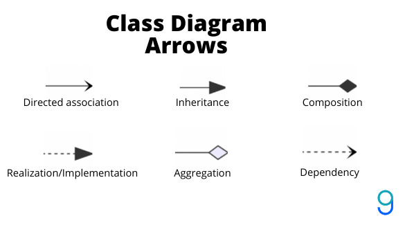

# Design Patterns

## Creational design patterns
These design patterns are all about class instantiation. This pattern can be further divided into class-creation patterns and object-creational patterns. While class-creation patterns use inheritance effectively in the instantiation process, object-creation patterns use delegation effectively to get the job done.

- Factory Method: Creates an instance of several derived classes
- Abstract Factory: Creates an instance of several families of classes
- Singleton: A class of which only a single instance can exist
- Builder: Separates object construction from its representation

## Structural design patterns
These design patterns are all about Class and Object composition. Structural class-creation patterns use inheritance to compose interfaces. Structural object-patterns define ways to compose objects to obtain new functionality.

- Decorator: Add responsibilities to objects dynamically
- Adapter: Match interfaces of different classes
- Facade: A single class that represents an entire subsystem

## Behavioral design patterns
These design patterns are concerned with communication between objects.

- Strategy: Defines a family of interchangeable algorithms that can be pluggedd in without changes to the client
- Observer: A way of notifying change to a number of classes
- Command: Encapsulate a command request as an object

## Notes
UML arrows:

- Direct association = has a
- Inheritance = is a

## References
[Refactoring Guru](https://refactoring.guru/design-patterns)

[Design Patterns by Source Making](https://sourcemaking.com/design_patterns)

[Design Patterns in Object Oriented Programming by Christopher Okhravi (playlist))](https://www.youtube.com/playlist?list=PLrhzvIcii6GNjpARdnO4ueTUAVR9eMBpc)

[Geeks for Geeks](https://www.geeksforgeeks.org/)
